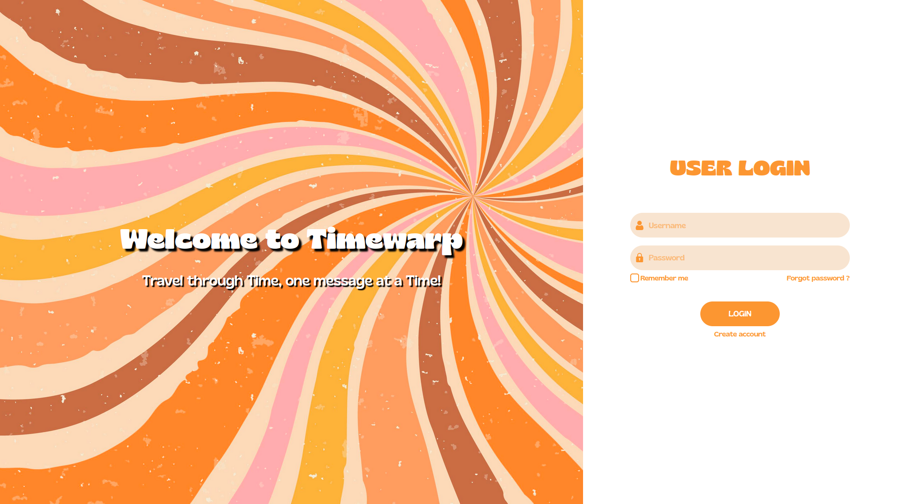
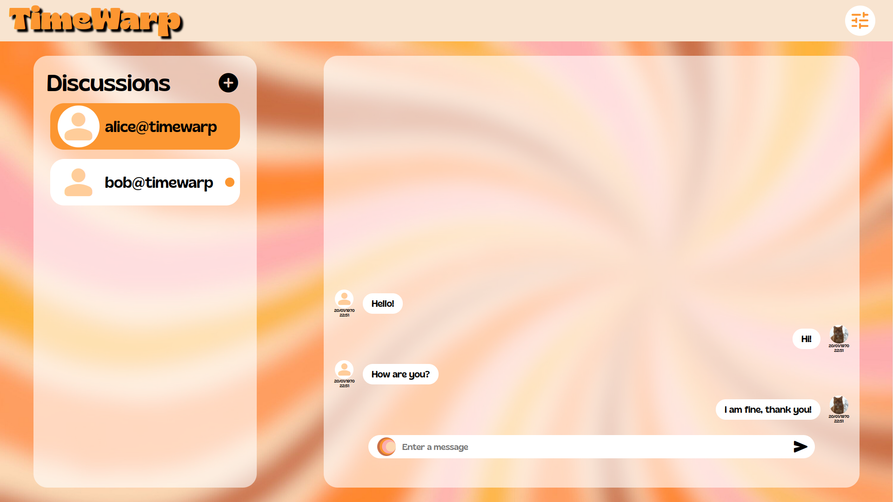
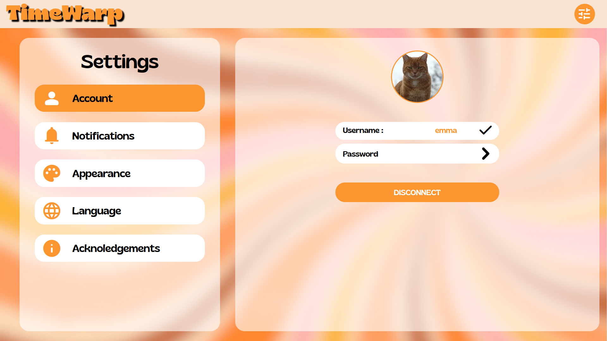
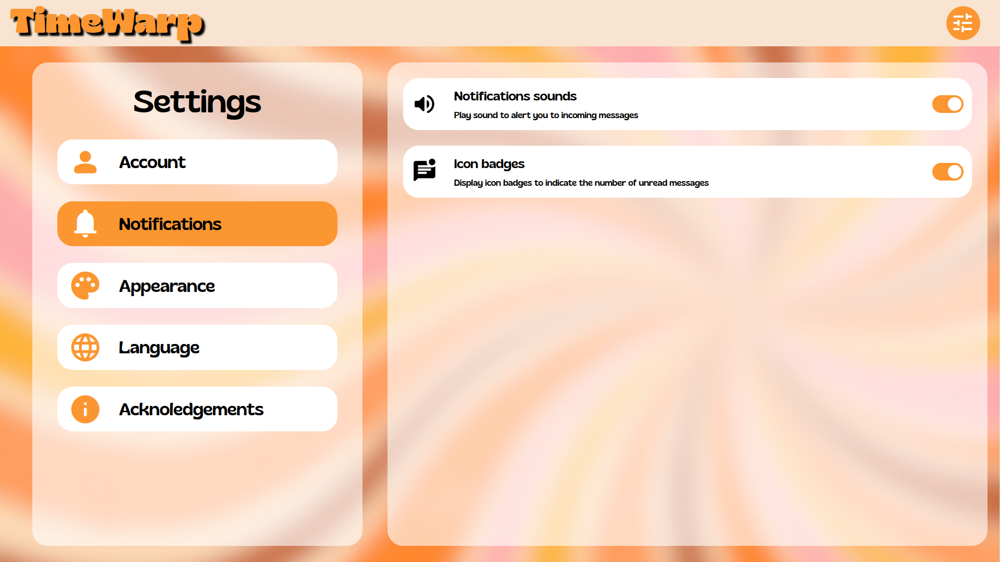
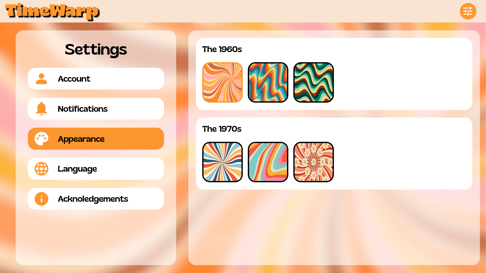
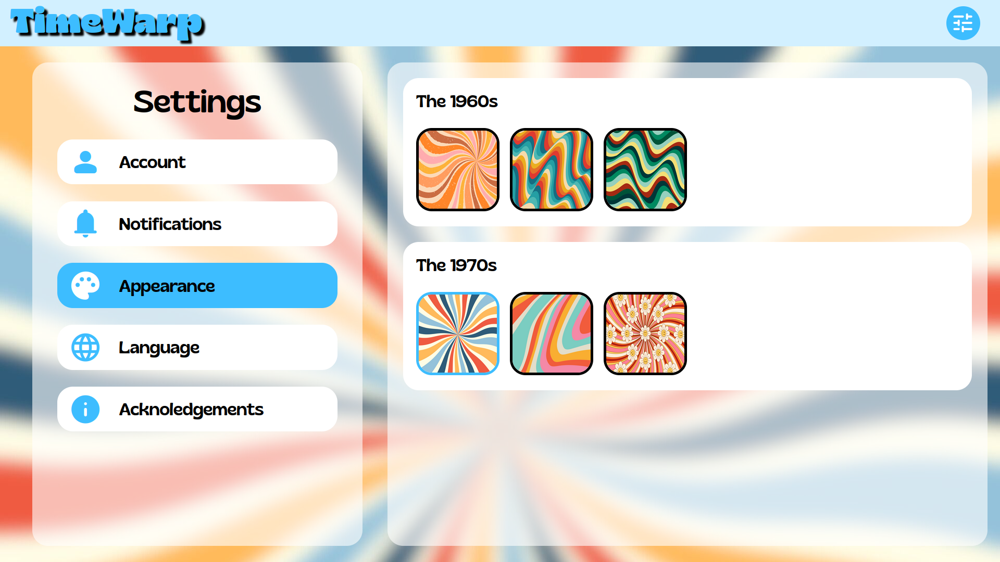
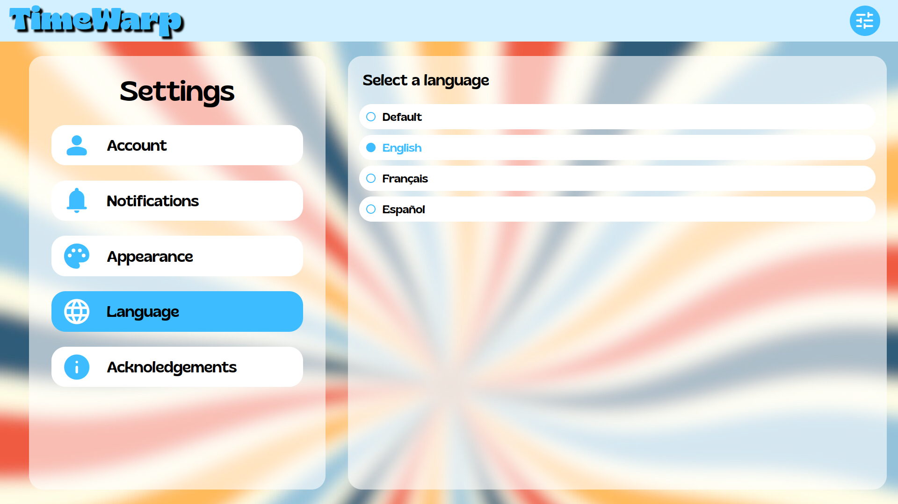

# TimeWarp

TimeWarp is a real-time messaging application, designed and developed by myself and my classmate during our 4th year of computer engineering. This application allows for instant communication between different applications via a username and domain (example: username@timewarp).

## Screenshots

Here are some screenshots of the TimeWarp application:









## Getting Started

To get the TimeWarp application up and running on your local machine, follow these steps:
s
### Prerequisites

Ensure you have the following installed:
- Java Development Kit (JDK) for the server side
- Node.js and npm for the client side

### Starting the Server

1. Navigate to the server directory:
```bash
cd path/to/server
```

2. Start the server using Maven:
```bash
mvn spring-boot:run
```

### Starting the Client

1. Navigate to the client directory:
```bash
cd path/to/client
```

2. Install the necessary npm packages:
```bash
npm install
```

3. Start the client application:
```bash
npm run start
```

Now, the TimeWarp server and client should be running, and you can access the application through your web browser.

### Important Note on the Router
The default router will not be operational anymore. To test the application, you will need to create and configure your own router. Please update the router link in the following file to your custom router configuration:

router/src/main/java/fr/mightycode/cpoo/router/WebSocketConfig.java

This step is crucial for ensuring the application's messaging functionality works as expected.